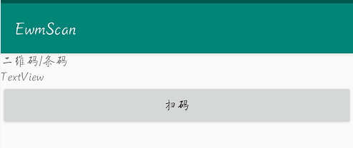
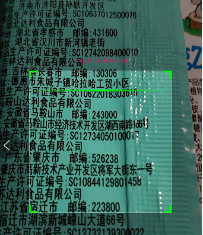
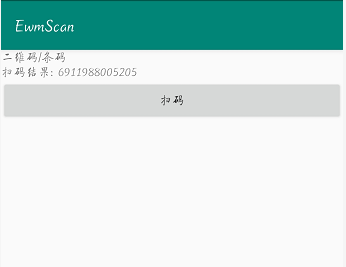

# 二维码/条码 扫码识别

开发环境 android studio 4.1 

# 示例

### 问题
java.lang.NoSuchMethodError: No interface method sort(Ljava/util/Comparator;)V in class Ljava/util/List; or its super classes (declaration of 'java.util.List' appears in /system/framework/core-libart.jar)

### 解决
https://blog.csdn.net/sinat_38184748/article/details/90643814

降级库到 3.3.3版本
com.google.zxing:core:3.3.3

### 条码识别代码来自

https://www.jianshu.com/p/a48aa18a6674?utm_campaign=haruki
https://github.com/fanbaoying/QrCodeScan-master